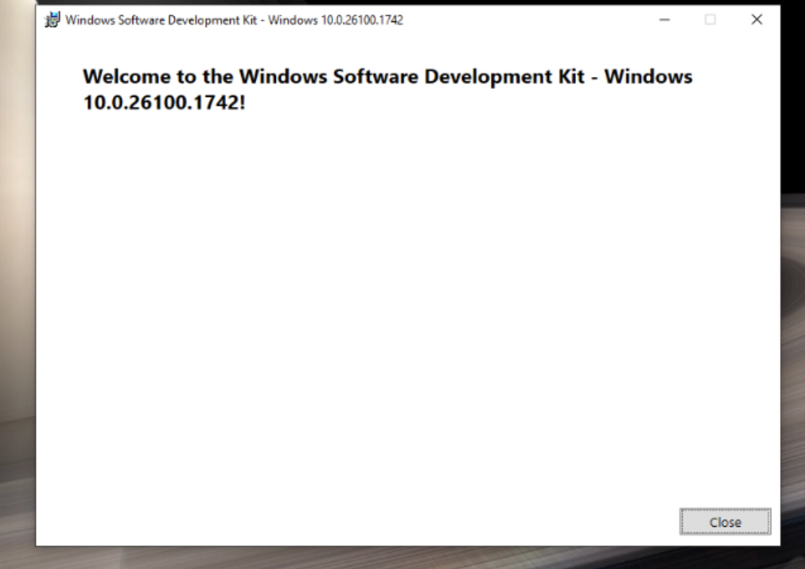
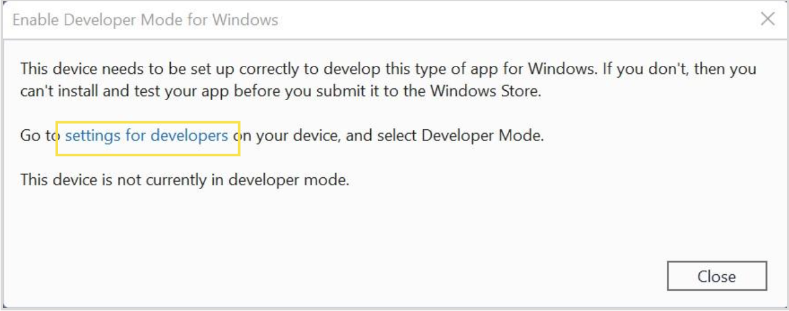
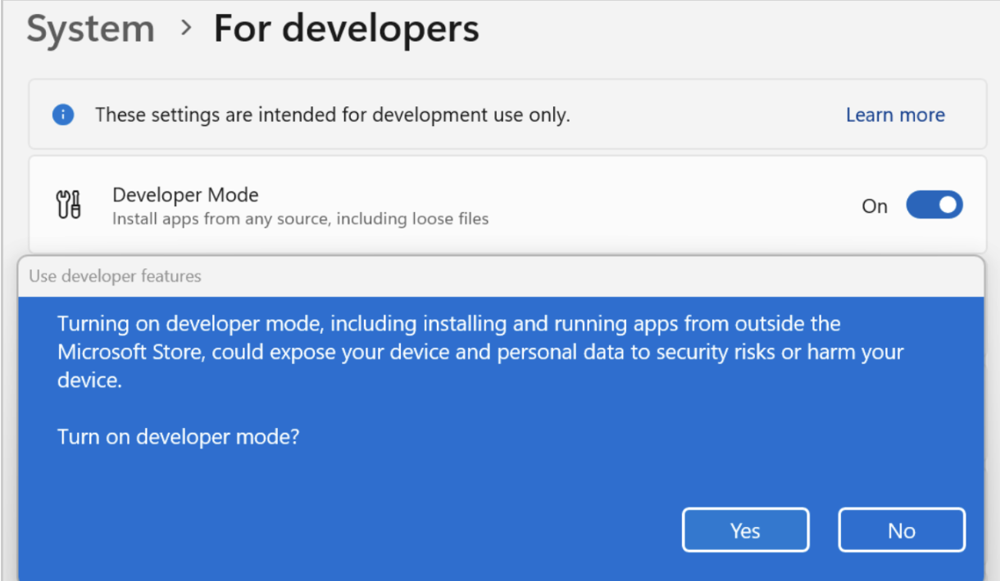
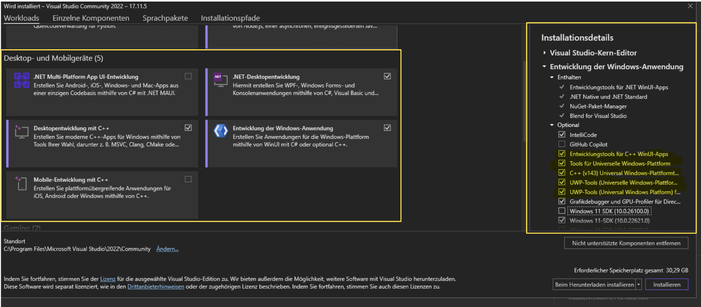
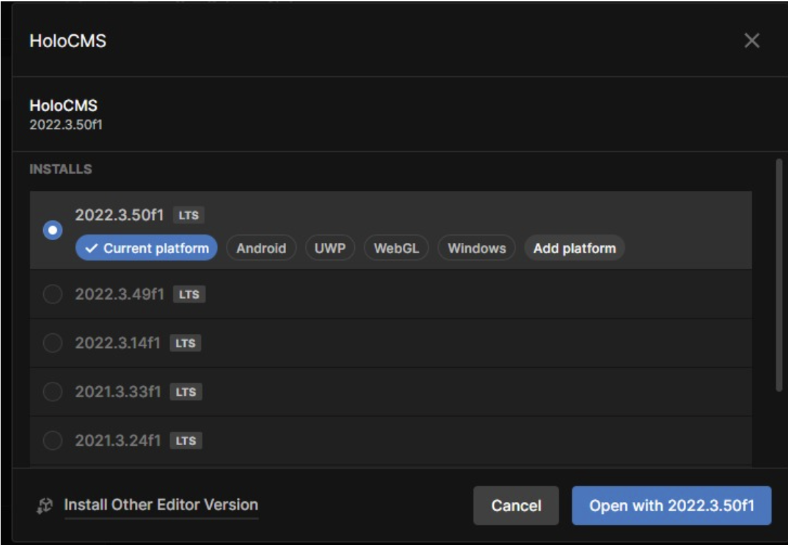
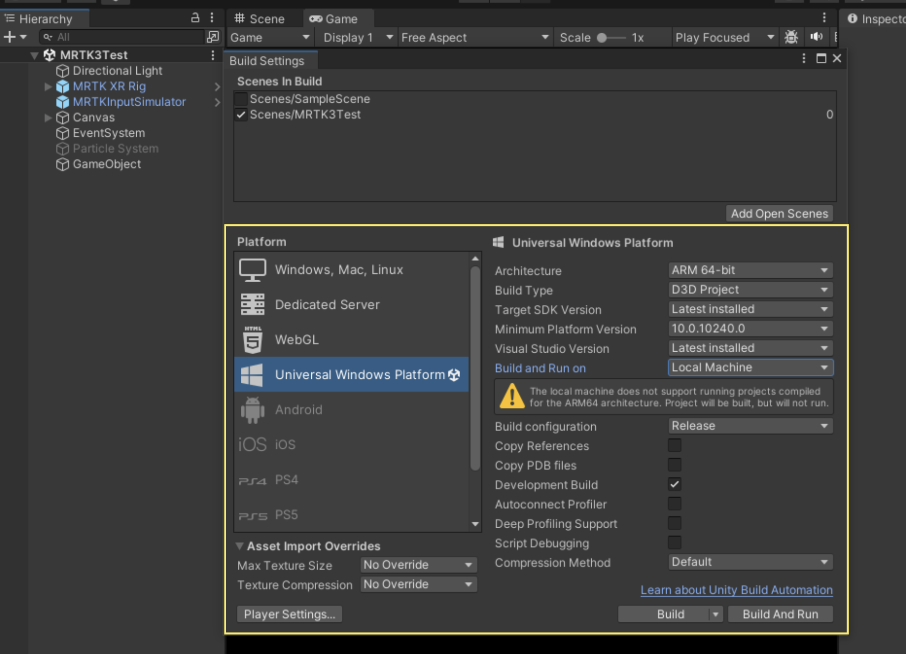
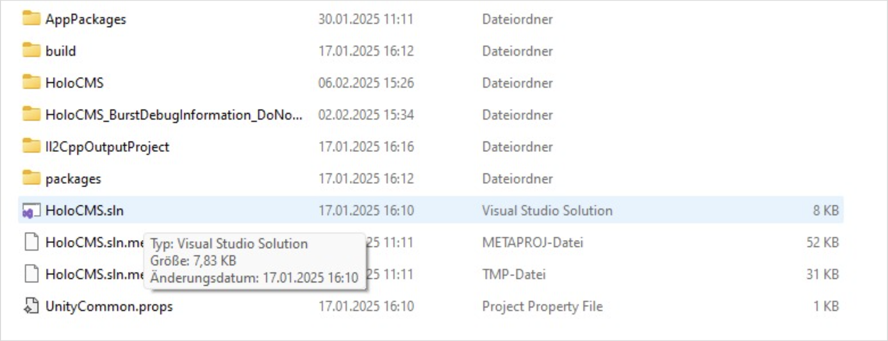
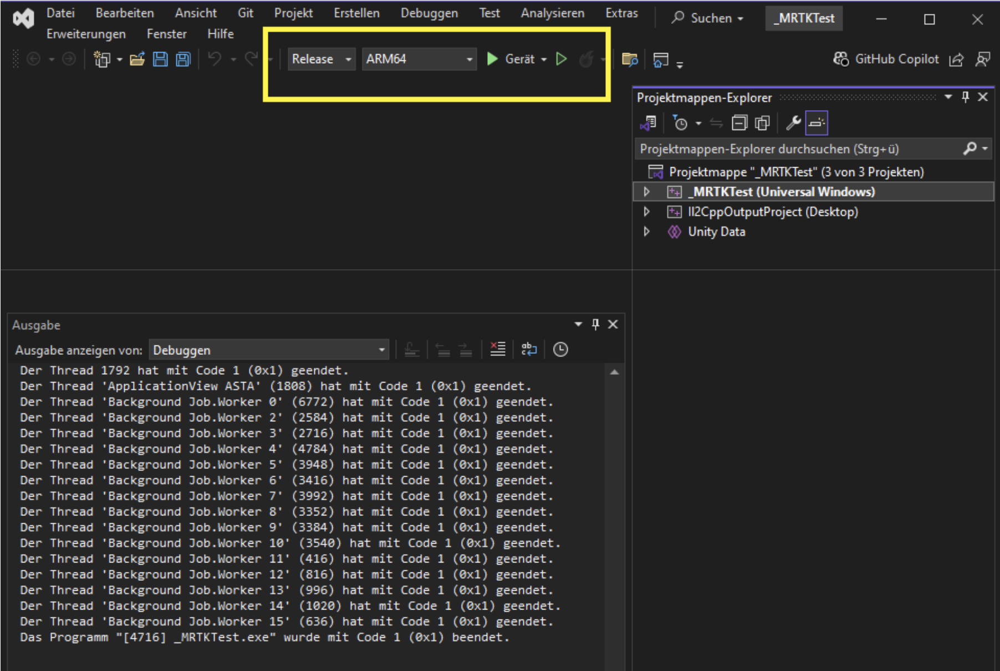

# 1. HoloCMS
HoloCMS ist eine Mixed-Reality-Anwendung für die Microsoft HoloLens 2, die es ermöglicht, benutzerdefinierte QR-Codes zu scannen und dynamische Inhalte aus einem webbasierten Content-Management-System (CMS) in Augmented Reality (AR) darzustellen.

Das Projekt wurde für das Forschungs- und Bildungszentrum für Kultur und Informationstechnologie (FKI) entwickelt und bietet Nutzern die Möglichkeit, interaktive und visuell ansprechende Inhalte an verschiedenen Orten zu erkunden.


# 2. Deployment

## 2.1. Vorbereitungen
Bevor das Projekt auf der Microsoft HoloLens geöffnet oder deployed werden kann, müssen zunächst einige Vorbereitungen getroffen werden:
- Unity installieren
- Windows SDK installieren
- Visual Studio 2022 installieren

### 2.1.1. Unity Installieren
Um das Projekt öffnen zu können, muss zunächst Unity Hub installiert werden<sup>[1]</sup>.

### 2.1.2. Windows SDK Installieren
Um Universal-Windows-Platform (UWP) Anwendungen zu erstellen, wird das Windows Software Development Kit (SDK) benötigt<sup>[2]</sup>. Dieses muss heruntergeladen und installiert werden.



Wenn mit Visual Studio gearbeitet wird, muss der Entwicklermodus sowohl auf dem Entwicklungs-PC als auch auf allen Geräten aktiviert werden. Falls der Entwicklermodus beim Öffnen eines UWP-Projekts nicht aktiviert ist, wird entweder die Einstellungsseite für Entwickler geöffnet oder das folgende Dialogfeld in Visual Studio angezeigt. Hier kann man nun direkt zu den Einstellungen gelangen.



**Alternativ:** Um den Entwicklermodus auf Windows zu aktivieren, folge diesen Schritten<sup>[3]</sup>:
1. Öffne die Windows-Einstellungen.
2. Gehe zu „Update & Sicherheit“ und wähle „Für Entwickler“.
3. Setze die Einstellung „Entwicklermodus“ auf „Ein“.



### 2.1.3. Visual Studio Installer installieren und konfigurieren
Lade zunächst den Visual Studio Installer herunter<sup>[4]</sup>. Im Visual Studio Installer kannst du unter dem Reiter „Workloads“<sup>[5]</sup> die benötigten Komponenten auswählen, wie im Screenshot unten gezeigt.



## 2.2. Projekt Deployen

### 2.2.1. Project via GitHub Repository klonen

Der „development“-Ordner enthält das komplette Projekt, das in Unity geöffnet werden kann. Nutze hierfür die den HoloApp Ordner-Inhalt. Dieser kann via Unity importiert werden.

### 2.2.2. Projekt in Unity Hub öffnen

Öffne Unity Hub und klicke auf „Add“, dann auf „Add project from disk“. Wähle das Zielprojekt ("HoloApp") im Datei-Explorer aus. Das Projekt wird dann im Unity Hub hinzugefügt. Stelle sicher, dass die aktuell unterstützte Editor-Version „2022.3.50f1“ verwendet wird. Falls dies nicht der Fall ist, wähle die korrekte Version aus.



Nun kannst du das Projekt nach Bedarf konfigurieren und Änderungen vornehmen.

### 2.2.3. Projekt builden
Um das Projekt auf der Microsoft HoloLens zu deployen, musst du es zunächst für das Deployment vorbereiten. Öffne hierzu „File“ > „Build Settings“ in Unity. Wähle „Universal Windows Platform“ als Zielplattform aus<sup>[6]</sup>. Konfiguriere alle weiteren Build-Einstellungen gemäß den Angaben im Screenshot.



Klicke anschließend auf „Build“. Der Projektordner öffnet sich im Datei-Explorer. Wenn du das erste Mal baust, musst du auf der obersten Ebene einen Ordner „Builds“ erstellen. Wenn bereits vorher ein Build erstellt wurde, ist dies nicht erforderlich. Öffne den „Builds“-Ordner und klicke auf „Ordner auswählen“.

Im Hintergrund wird nun der Build erstellt, der später auf die Microsoft HoloLens deployed werden kann. In der Zwischenzeit kannst du die HoloLens über USB-C mit dem Rechner verbinden, auf dem der Build gerade erstellt wird. Sobald der Build abgeschlossen ist, öffnet sich der Projektordner im Datei-Explorer.

Öffne den „Builds“-Ordner und öffne die .sln-Datei (Visual Studio Solution) in Visual Studio.



### 2.2.4 Microsoft HoloLens verbinden und Projekt deployen
Zu diesem Zeitpunkt muss die Microsoft HoloLens angeschlossen sein.

Wähle oben im Visual Studio-Fenster „Release“ und „ARM64“ aus und klicke auf „Gerät deployen“<sup>[7]</sup>.



Besonders beim ersten Deployment kann der Prozess etwas länger dauern. Sobald das Deployment abgeschlossen ist, siehst du am unteren Rand eine rote Meldung mit der Aufschrift „Bereit“. Jetzt kannst du die Microsoft HoloLens vom Rechner trennen und starten. Unter den Apps findest du die Anwendung, die du nun öffnen kannst.

## 2.3. Export und Import eines Drupal CMS zwischen zwei Servern
Diese Anleitung beschreibt den vollständigen Prozess zum Übertragen einer Drupal-Installation inklusive Datenbank von einem Server auf einen anderen. Dafür ist es notwendig, sich via Terminal mit root Rechten und SSH auf dem entsprechenden Ziel- und Ausgangsserver verbinden zu können.

### 2.3.1. Vorbereitung des Zielservers
Einen neuen Docker - Container mit PHP und Debian aufsetzen.

Bei Bedarf eine neue MariaDB-Instanz erstellen. (Required bei FKI Server)

### 2.3.2. Datenbankexport
Die Datenbank wird mit Drush als SQL-Dump exportiert und komprimiert: <br>
`vendor/bin/drush sql:dump | gzip > /tmp/holoBack20250228.sql.gz`

### 2.3.3. Drupal-Dateien exportieren
Die Drupal-Dateien werden als Archiv gepackt und per SSH übertragen: <br>
`tar czf /tmp/holobackend20250128.tar.gz /var/www/mrdata.13-bits.de/`

Beide Export-Dateien können dann auf dem Zielserver hochgeladen und entpackt werden.

### 2.3.4. Server-Konfiguration - Zielserver
- DocumentRoot muss auf den web-Ordner der Drupal-Installation zeigen.
- Die Datenbankverbindung muss in der Datei `web/sites/default/settings.php` angepasst werden.
- Der PHP-Prozess benötigt Schreibrechte im Verzeichnis `web/sites/default/files` (rekursiv für alle Dateien).

### 2.3.5. Datenbank importieren auf Zielserver - Terminal Befehle (bash)
MySQL-Konsole öffnen: <br>
`mysql -u username -p -h hostname`

Neue, leere Datenbank auswählen: <br>
`USE (datenbankname);`

SQL-Dump importieren: <br>
`mysql -u username -p -h hostname Datenbankname < /pfad/zur/sql-datei.sql`

### 2.3.6. Datenbankeinstellungen für php in Drupal aktualisieren
Die Datei `settings.php` befindet sich standardmäßig unter: <br>
`/drupal/web/sites/default/settings.php`

Am Ende dieser Datei müssen die korrekten Datenbankverbindungsinformationen eingetragen werden, um diese mit Drupal zu verbinden:
```php
$databases['default']['default'] = [
  'driver' => 'mysql',
  'database' => 'drupaldb1',
  'username' => 'username',
  'password' => 'secret',
  'host' => 'dbserver1',
];
```

Nach diesen Schritten sollte die Drupal-Instanz erfolgreich auf den neuen Server migriert sein und ein vollständiges Spiegelbild des Ausgangsservers inklusive Datenbankinhalten ist vorhanden.

## 2.4. Workflow Anlegen von Points of Interest im Content Management System
**Achtung**: Um eine funktionale Verbindung zwischen Hardware und CMS zu garantieren, muss sichergestellt werden, dass die korrekte URL des entsprechenden CMS Exports zum Zeitpunkt der Nutzung innerhalb der Applikation eingetragen ist. 

**URL anpassen:** 
In der „MainScene“ des Unity-Projekts befindet sich im „Canvas“ das GameObject „JsonURLReader“ (siehe linken Bereich – in der Hierarchy). Dieses GameObject enthält das Script „Json URL Reader Script“ (siehe rechten Bereich – im Inspector). Hier kann die „Json URL“ einfach durch die aktuelle API-URL ersetzt werden. 
Genauere Anweisung unter Punkt 5.2.6 in der Dokumentation.

Die Medienverwaltung innerhalb des CMS ist auf verschiedene Arten möglich. Bilder und Videos können jeweils beim Erstellen eines Points of Interest hochgeladen oder innerhalb einer Media Library verwaltet und hochgeladen werden, unabhängig von der Verwendung innerhalb eines Datenobjektes.

Über den Menüpunkt der Seitenleiste „Media“ kann eine Übersicht über die vorhandenen Dateien aufgerufen werden. Zusätzlich besteht die Möglichkeit, über den Button „Add Media“, im oberen rechten Bereich des CMS, Bilder oder Videos in der Datenbank zu speichern.

Nach erfolgreicher Anmeldung kann im Seitenmenü unter dem Punkt „Content“ eine Übersicht über die bereits bestehenden Datenobjekte und Medieninhalte aufgerufen werden. Über die Schaltfläche „Add Content“ kann ein neues Point of Interest Datenobjekt angelegt werden. Hierbei ist ein Titel (Überschrift) zwingend erforderlich. Die nachfolgende Auswahl bezieht sich auf die Layout Version welche mit einem Hilfetext näher erläutert wird. Der ausgewählte Typ (Text, Image, Video) reguliert gleichsam die Möglichkeit ein optionales Image Auswahlmenü oder Video Auswahlmenü zu nutzen, um gewünschte Inhalte zu verwalten und zu verknüpfen.

Die zusätzlich erstellten QR-Codes müssen mit Werten von 0-9 codiert werden, wobei die Reihenfolge der Zahlen der Erstellungsreihenfolge der POI im CMS entspricht. Hierfür empfehlen wir im QR-Code-Generator die Zahlen als Text anzulegen<sup>[8]</sup>.

___

**Links** <br>
[1] https://unity.com/de/download <br>
[2] https://developer.microsoft.com/de-de/windows/downloads/windows-sdk/ <br>
[3] https://learn.microsoft.com/de-de/windows/apps/get-started/enable-your-device-for-development <br>
[4] https://visualstudio.microsoft.com/de/ <br>
[5] https://learn.microsoft.com/en-us/visualstudio/install/modify-visual-studio?view=vs-2022<br>
[6] https://learn.microsoft.com/en-us/windows/mixed-reality/develop/unity/new-openxr-project-with-mrtk <br>
[7] https://learn.microsoft.com/en-us/windows/mixed-reality/develop/advanced-concepts/using-visual-studio?tabs=hl2 <br>
[8] https://www.qrcode-monkey.com/de/#text
